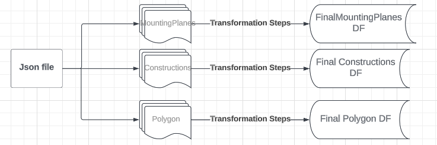
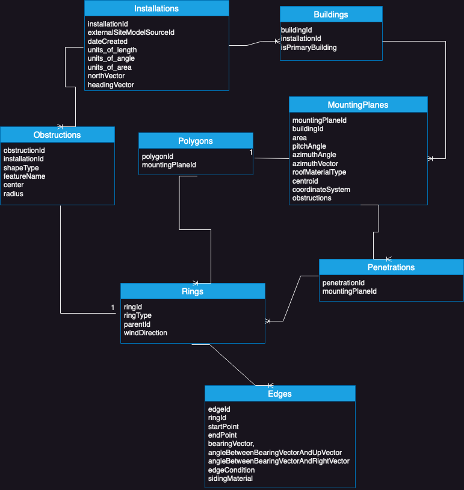

# Overview
For the input json files, a data pipeline with generic functions are written in the main.py file to transform the data to meet the business requirements. 

#### Run the below command from root of the repository.

```   
    ./run clean-all
```
Note: Clean-all can be used to remove outputfiles (csv) in the Docker Container

### Folder Structure:
```
    root
    |_roof_models: input json files
    |_main.py:logic implementation
    |_requirements.txt: modules to be installed in the Docker image
    |_DockerFile and docker-compose.yml: Docker image and container configuration
    |_run: bash script which automates the Docker container steps
    |_docs:containing images
```

# Data:
With 10 json files that are flattened, each file divided into 3 data frames. Primarily used pandas json_normalize() to flatten the file and load into a data frame.
The reason I split each file into 3 data frames as shown below was due to model simplicity. All the respective data frames are concatenated into their respective data frame leading to one final data frame for each of them.
```
SiteModel -> MountingPlanes containing:
id	area	pitchAngle	azimuthAngle	azimuthVector	roofMaterialType	centroid	coordinateSystem	polygon	obstructions isPrimaryBuilding	totalRoofArea

SiteModel -> Constructions:
id	shapeType	featureName	ring	center	radius

SiteModel -> buildings -> Polygon:
[ExteriorRing, InteriorRing]
```
Note: Some columns are further flattened based on individual use case
The code base supports versions v1, v2 and v3 and will raise an exception if other formats are input. For further updates in the model the code base can be updated accordingly.


# Pipeline:




# Observations:
1) If the shape type is Ring and feature is a rectangle, coordinates are zero as the obstruction radius is also zero
2) Based on my research regarding Solar roofs, pitch angle(elevation angle) => the recommended deg is 30 to 45 deg. Hence, for data below and above this threshold is handled in the angle_precession() method
3) Additionally, for the Azimuth Angle- since the sun rises in the east and sets in the west, regardless of the latitude, the recommended angle is between 90 deg to 270 def. Hence, this is also handled in angle_precession() method.
4) Feature Engineering: With limited domain knowledge, for now, certain column values as discussed in the above point are ensured to have the required data and format. However, with further business requirement, additional features can be engineered from existing ones.
5) When obstruction radius is zero(with no obstruction) feature name and shape type are 'Rectangle' and 'Ring' respectively. Similarly, when the obstruction 'Radius' is the highest(12), 'feature_name' and 'ShapeType' are 'DWV-Plastic' and 'Circle' respectively. With this info, we can induce a new binary feature indicating if there is any obstruction. 

# Future Scope:
A data model can be further developed to maintain the design and integrity of the data. As shown below the following relational schema can be used to create a relational data model.





Local env: Conda env is set up to containerize the Python environment.

